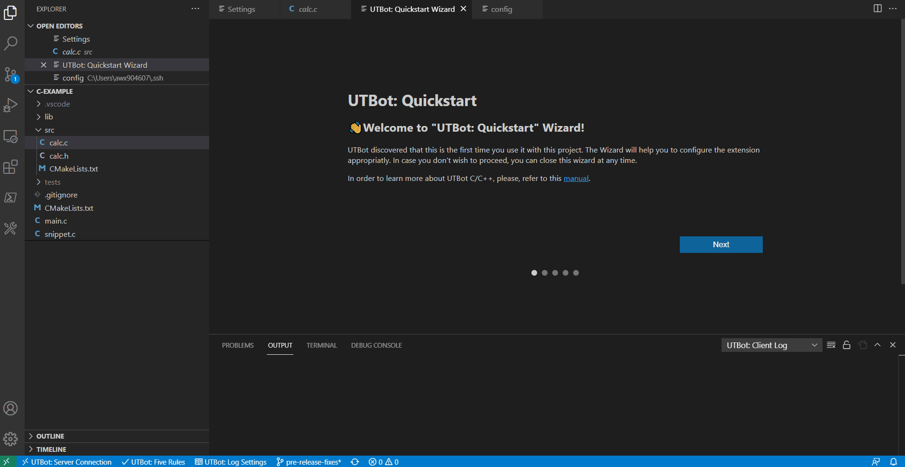

#UTBot Developer Guide

## How to build UTBotCpp from source

UTBot has many dependencies, so the easiest way to build the tool from source and develop it is to use the docker container.

UTBot has a published docker package called [base_env](https://github.com/UnitTestBot/UTBotCpp/pkgs/container/utbotcpp%2Fbase_env).
It contains all the needed dependencies such as Git, LLVM, GRPC, GoogleTest and others. **base_env** has multiple versions tagged with dates.
If you are developing the tool, you are most likely to need the most recent version from [here](https://github.com/UnitTestBot/UTBotCpp/pkgs/container/utbotcpp%2Fbase_env). 

Supported and tested development configuration are Ubuntu 18.04, Ubuntu 20.04 or Windows Subsystem for Linux (+Ubuntu 18.04 / 20.04).
 
To build UTBot from sources:
1. Install docker for [Ubuntu](https://docs.docker.com/engine/install/ubuntu/) or [WSL+Ubuntu](https://docs.docker.com/desktop/windows/wsl/)
2. Install docker plugin that allows to mount host filesystem and remap owner and group:  
   ```
   docker plugin install lebokus/bindfs
   ```
3. Login into github docker registry: 
   ```
   docker login -u <github-username> -p <github-personal-access-token> ghcr.io
   ``` 
   > You can create new <personal-access-token> on [this github page](https://github.com/settings/tokens/new). Don't forget to check `read:packages` permission.   
   > More details are described [here](https://docs.github.com/en/packages/working-with-a-github-packages-registry/working-with-the-container-registry#authenticating-to-the-container-registry).
   
4. Run `docker/utbot_docker_dev.sh` [script](https://github.com/UnitTestBot/UTBotCpp/blob/main/docker/utbot_docker_dev.sh). It will unpack the docker image and mount UTBot sources inside it.
   UTBot binary can be built in the docker and run in it.
   The script will prompt you to enter docker image tag. You can find the most recent tag [here](https://github.com/UnitTestBot/UTBotCpp/pkgs/container/utbotcpp%2Fbase_env), for example `24-11-2021`. 
   
   Installer will ask about `ssh_port` on host machine. This port will be forwarded inside container's ssh port (by default `sshd` in container listens 2020). 
   You may then login inside docker via `ssh utbot@host -p $ssh_port`, where `host` is a host machine IP address.
   > ⚠ Specify free port that is not in use on host machine!
    
   Also, you will be prompted to enter a gRPC port on host machine that will be forwarded inside container's 2121 port where UTBot listens gRPC requests.   
   > Script will run docker image, mount specified folder on host filesystem into container's filesystem and forward ports for ssh and gRPC.
    
   
 
5. Login via ssh into newly started container
   ``` 
   ssh utbot@host -p $ssh_port 
   ``` 
   > You can type `localhost` as `host` if you are inside terminal of a host machine)
   > If you are prompted a password, enter `utbot`.

6. Clone UTBotCpp repository into home directory **inside docker container**, preferably with ssh.
7. `cd` into `UTBotCpp` directory and run `build.sh` — it is the script that builds KLEE UTBot and runs UTBot unit tests
8. Clone submodules `git submodule update --init --recursive`
9. Navigate to `UTBotCpp/server/build` directory and launch the binary with `./utbot server` command. Now the server is running.
10. Launch VS Code on your local machine. Use VS Code [Remote-SSH](https://code.visualstudio.com/docs/remote/ssh) to get access to the docker insides. Navigate to `UTBotCpp/vscode-plugin` directory and run `build.sh` script.
11. Press F5 (*Run Extension*). This will run UTBot VS Code plugin.
12. A new VS Code window will open; this window will have UTBot VS Code plugin enabled. In this new folder, open `UTBotCpp/integration-tests/c-example` directory.
13. When UTBot Quickstart Wizard requests you to enter server host and port, specify `localhost` and UTBot server run port 2121, respectively.
   
14. Select project path as `/home/utbot/UTBotCpp/integration-tests/c-example`;
15. You are now ready to experience UTBot capabilities! You can view possible commands in Command Palette (Press F1 and type in UTBot).

If you want to change UTBot test generation preferences, you can edit them in  File > Preferences > Settings > Extensions > UnitTestBot.
After UTBot configuration, you can select your source directories with the tab on the VSCode toolbar on the left. Then, you can generate tests with the use of Command Palette. Press **F1** and type in "UTBot": You will see tests generation options.

## How to develop UTBotCpp with an IDE

You can edit UTBot sources, rebuild and rerun the server with an IDE. Usually, CLion *Remote host* toolchain is used for it.

To setup it:
1. Open UTBotCpp project with CLion on your local machine.
2. Open **Settings > Build, Execution, Deployment > Toolchains**.
3. Add a new *Remote Host* toolchain.
4. In *Credentials* section, set up an `ssh` connection to the UTBot docker container you have. Consider enabling connection via OpehSSH authentification agent to ease files synchronization.
5. All other fields should fill in automatically.


## Troubleshooting the build
### read -i invalid option
You can experience this on Mac OS:
```shell
read: -i: invalid option
```
It is because Mac OS has too old bash version. Upgrade bash version and set it to default:
```shell
brew install bash
chsh -s /usr/local/bin/bash
```
### Problem with gRPC
If you experience this problem:
```shell
--grpc_out: protoc-gen-grpc: Plugin failed with status code 1.
/bin/grpc_cpp_plugin: program not found or is not executable
```
```shell
ninja: error: 'protobuf/testgen.grpc.pb.h', needed by 'CMakeFiles/utbot.dir/main.cpp.o', missing and no known rule to make it
```
Copy the program to /bin:
```shell
cp /utbot_distr/install/bin/grpc_cpp_plugin /bin/
```
### Error while mounting empty volume
If this error happens on Mac OS:
```shell
docker: Error response from daemon: error while mounting volume '': VolumeDriver.Mount: exit status 1%!(EXTRA []interface {}=[]).
```
Remove the following line in utbot_docker_dev.sh: 
```shell
 -v $MOUNT_LOCAL_NAME:/home/utbot/mnt \
```

### Failed to load project in CLion
If error like this happens then you try load Cmake in CLion
```
CMake File API: C:\Users\kWX1061625\work\UTBotCpp\server\cmake-build-debug-remote-host-ml: target-gmock-Debug-0b6fa789e179f468efb4.json: no CMakeLists.txt file at '\utbot_distr\gtest\googlemock\CMakeLists.txt'
```
[check solution in issue](https://youtrack.jetbrains.com/issue/CPP-27998)


### Problems with build in Visual Studio Code
If you experience this error:
```shell
command npm run watch terminated with exit code 1
```
Then there is compilation error and if it is not fixed the previous version of the code will run (debugger won't work correctly)
