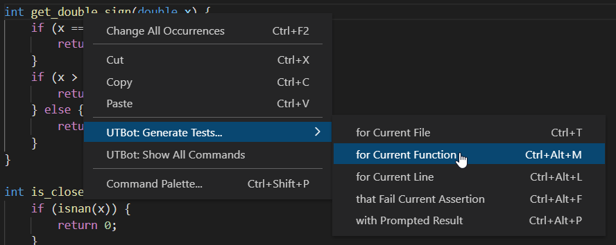
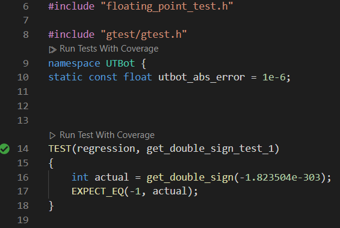
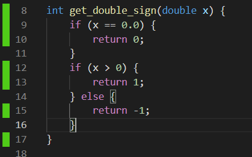
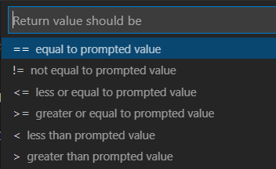
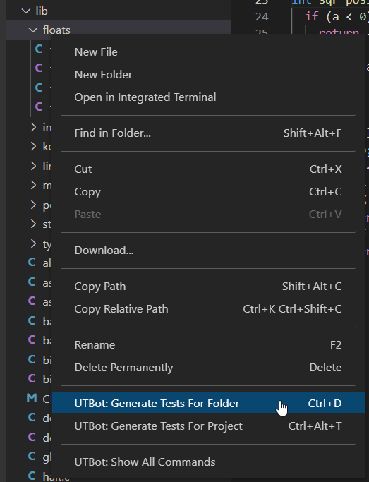
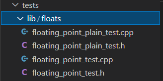

# How to check UTBot manually

It's recommended to perform some smoke checks on UTBot before raising a pull request

## Check installation in your own local environment

Download an archive with build artifacts on a local machine and unpack it into separate folder locally

- [ ] Check folder contains:

    - ```utbot_distr.tar.gz``` - UTbot binary/dependencies
    - ```utbot_plugin.vsix``` - UTBot plugin for VSCode
    - ```unpack_and_run_utbot.sh``` - setup script
    - ```version.txt``` - version file


- [ ] Perform setup on server side:

Move binary and script into a new separate directory

```
    mkdir utbot-release-version
    mv utbot_distr.tar.gz utbot-release-version
    mv unpack_and_run_utbot.sh utbot-release-version
```

and run installation script in it

```
    cd utbot-release-version
    chmod +x unpack_and_run_utbot.sh && ./unpack_and_run_utbot.sh
```

Check process is up and running

```
    ps aux | grep utbot | grep port
```

PID/port 2121 should be found

If no errors and process is up then

- [ ] Perform client setup:

    - In local VSCode look for *Install from VSIX* command, select early downloaded ```utbot_plugin.vsix``` and install
      it - "UnitTestBot for C/C++" plugin should be visible in Extensions
    - For Win: setup SSH remote connection with server - locally installed UTBot plugin should be available in remote
      mode (no new installation required)
    - Open folder with source code, test connection as proposed, click Next and finish setup configuring project

## Check UTBot: Generate Tests

On a source code project

- [ ] For Current Function:

1. Move to any function in the (as example) ```file.c```
2. Right mouse click &rarr; UTBot: Generate Tests... &rarr; for Current Function

   

- ```file_test.cpp``` is generated

  

- "Run Tests with Coverage" generates coverage report shown in a source ```file.c```

  


- [ ] For Current File:

1. Move to any `file2.c` in the project
2. Right click &rarr; UTBot: Generate Tests... &rarr; for Current File

- `file2_test.cpp` is generated
- "Run Tests with Coverage" generates coverage report shown in a source file


- [ ] For Current Line:

1. Move to any statement line in the `file3.c`
2. Right click &rarr; UTBot: Generate Tests... &rarr; for Current Line

- `file3_test.cpp` is generated
- "Run Tests with Coverage" generates coverage report shown in a source file


- [ ] With Prompted Result:

1. Move to any function in the `file4.c` code
2. On statement/assert Right click &rarr; UTBot: Generate Tests... &rarr; with Prompted Result
3. In appeared dialog select condition and enter some number &rarr; Press Enter

   

- `file4_test.cpp` is generated with selected condition on prompted result
- "Run Tests with Coverage" generates coverage report shown in a source file


- [ ] For Folder:

1. In project navigate to folder with several files
2. Right click &rarr; UTBot: Generate Tests for Folder

   

3. Select needed folder &rarr; OK

- directory with test files created:

  

- "Run Tests with Coverage" generates coverage report shown in a source file
  


