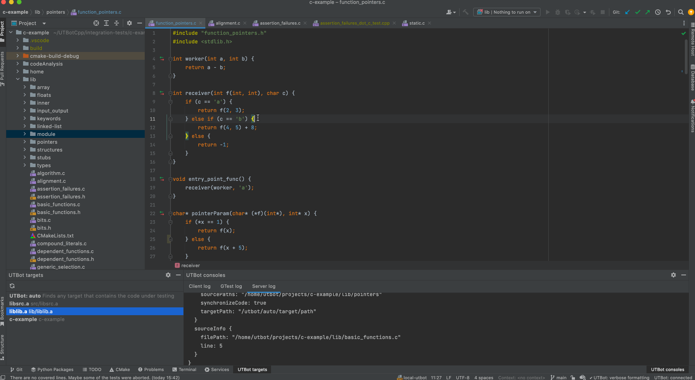

# Configuration

## Remote Scenario 

If you run UTBot and CLion on different hosts, synchronization of project files is required:

- If UTBot is run inside the Docker container, mount your project folder to Docker. 
- If UTBot is run under WSL, no additional configuration required, just 
specify remote path to your project in `Settings` or use `Quickstart Wizard` to 
fill it for you.
- If server is not run locally, CLion deployment can be used for synchronization, although it won't be 
fully automated, look at information below:

### Configuring CLion SFTP deployment for remote scenario

To configure SFTP do the following:

- Open `Settings -> Build, Execution, Deployment -> Deployment`
- Create SFTP configuration: click `+` and choose or create SSH config with server host and port, than
specify the path to your project on the remote machine in mappings, it is the same path you have specified
in `Settings` for remote path
- Go to `Options` and turn on upload on change:

- Go to `Project view` and right-click on your project root, then
  choose `Deployment`, click `Upload to ...` and choose the name of your
  SFTP configuration:

Now server can access your project files. 

When you change your files, CLion should upload changes to server. 

## Local scenario

Wizard allows you to  configure your project quickly without specifying different options manually in 
`Settings`. When you open your project for the first time, UTBot Wizard will be shown.

### Connection

After the first introductory step, you will be asked to
fill several settings: server port, server host and remote path.
Remote path specifies path to project on remote machine.

If UTBot is run on WSL or Linux (on the local machine), be sure 
to check the checkbox that fills in default values for the path and the port. 

### Build Directory and CMake Options

On the final Wizard step, UTBot will ask you to:
- specify relative path to the build directory
- set custom CMake options

### Demo

A demo how to go through the wizard:

## Plugin settings

The recommended way to configure plugin is to use UTBot Wizard. 

If some advanced settings are required, specify them in  `Settings -> Tools -> UTBot Settings`

### Remote path

Remote path is a path to your project on the remote host. If UTBot is run locally, leave it empty.

## Check configuration

When the connection to server is established, you can check project configuration 
to make sure that all path are specified correctly: just invoke `Configure project` action:

When project is configured, `Project is configured` notification appears:

When plugin is configured and configuration is checked, you can start using plugin to generate tests.
For further details how to use plugin see `USAGE.md`.