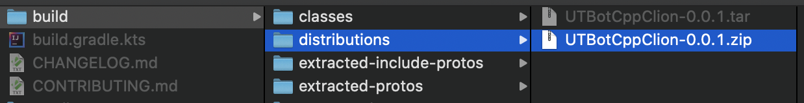
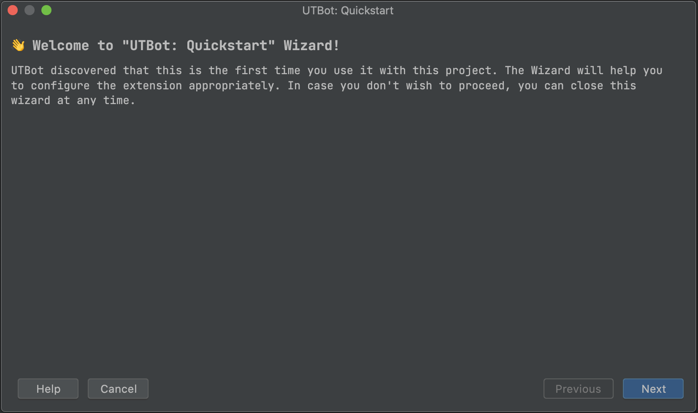
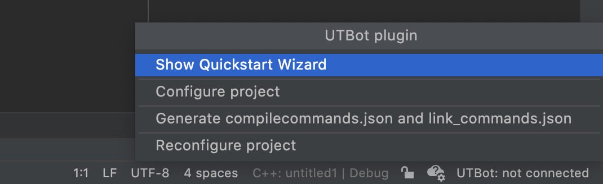
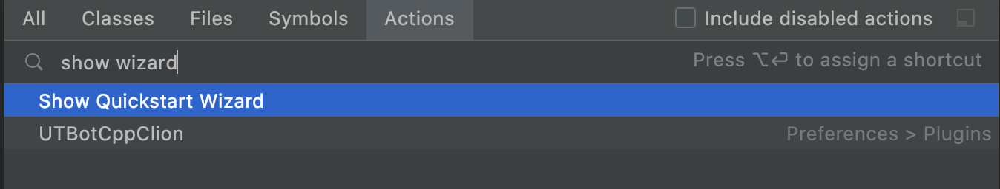

# UTBotCpp-CLion-plugin
<!-- Plugin description -->
Plugin to communicate with [UTBotCpp](https://github.com/UnitTestBot/UTBotCpp) server in CLion.

### Installation

1. Clone UTBotCpp into selected folder, select it in the command line and run:
```
cd clion-plugin
./gradlew assembleDist
```
2. Open CLion and go to `settings -> plugins`
3. Click `Install Plugin from Disk...`: 

4. Navigate to plugin folder `clion-plugin`, go to `build/distributions` 
and choose `zip` file:

5. Restart CLion

### Configuration

#### Using quickstart wizard
When the plugin is opened for the first time, a quickstart wizard appears.



You can open it manually any time: click on `connection status` and choose
`Show Quickstart Wizard` action.



or press `shift` twice and find this action: 




#### Using settings

You can also configure plugin using settings. All options can be set manually.

1. Open plugin settings in `settings` - `Tools` - `UTBot Settings`
2. Click `detect paths`. It tries to get source paths and build directories paths from CLion 
cmake model.
3. Specify an absolute path to the build directory, it should be different from the build directory that CLion uses, 
because conflicts between UTBotCpp and CLion may occur. For example, if CLion uses `project_path/cmake-build-debug`, 
you can specify `project_path/utbot_build`.
4. For target path specify `/utbot/auto/target/path`
5. Specify a path to test folder.
6. Specify a name of the server and port. 
7. If you use docker to run UTBotCpp and your project is mounted to docker, 
you can specify path to project inside docker.


<!-- Plugin description end -->