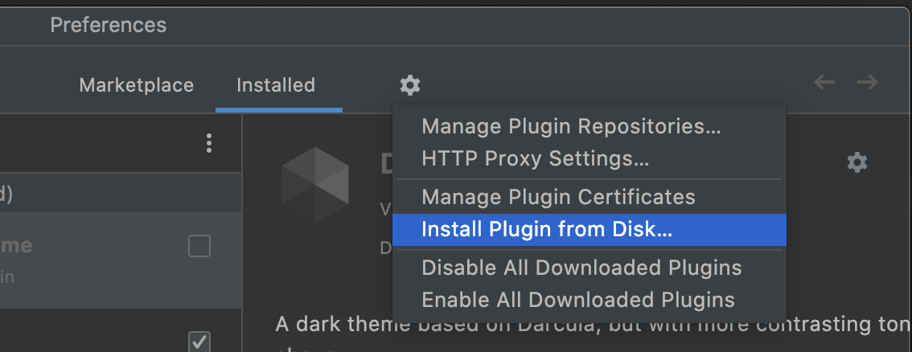

# UTBotCpp-CLion-plugin
<!-- Plugin description -->
Plugin to communicate with [UTBotCpp](https://github.com/UnitTestBot/UTBotCpp) server in CLion.
<!-- Plugin description end -->

### Installation

1. Open CLion. Go to `Settings -> plugins`
2. Uninstall the previous version of plugin. Skip this step if you install it for the first time
3. Click on `Settings` icon and then choose `Install from disk`

4. Choose plugin's zip file: `clion_plugin.zip`
5. Restart CLion

See `CONFIGURATION.md` to configure the plugin before use.
