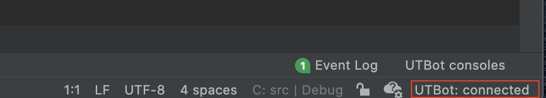
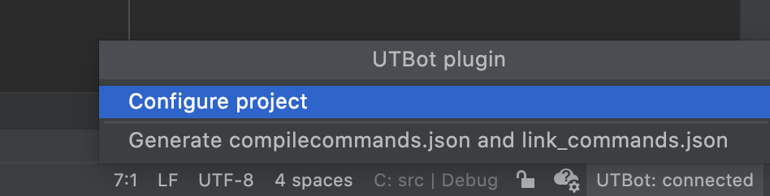
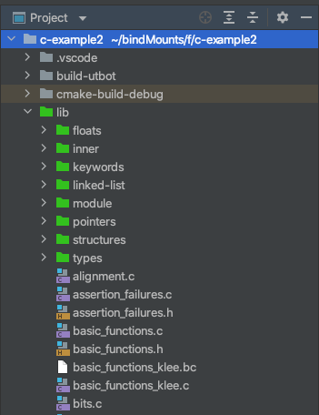
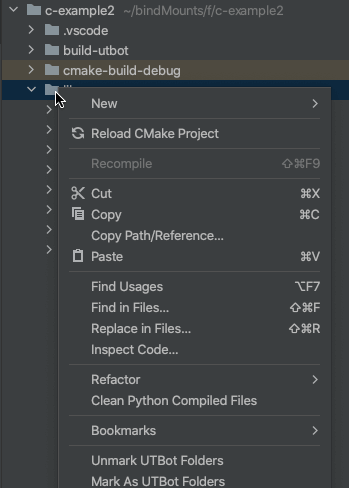
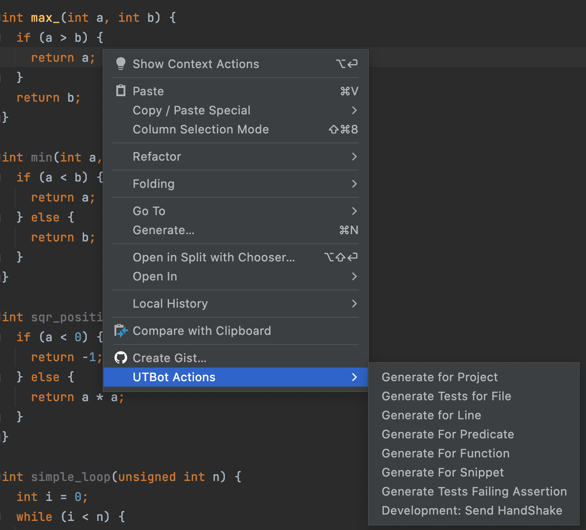
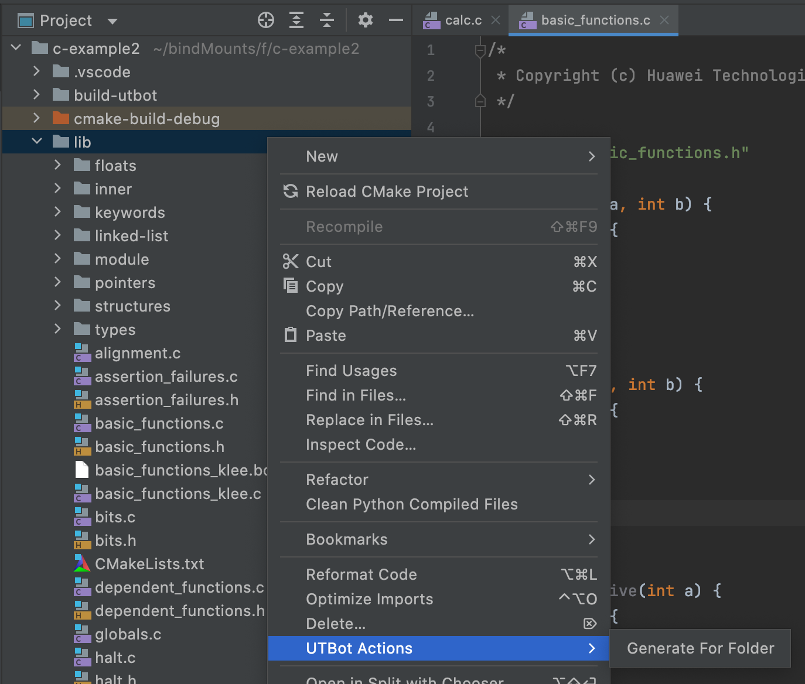
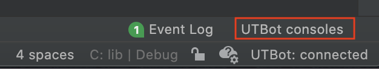
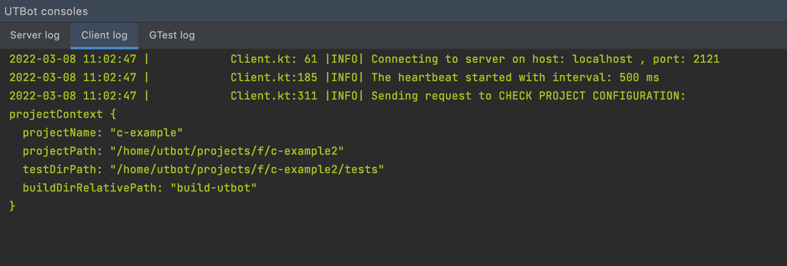

# How to use plugin

### Check connection status
To use plugin you should be connected to server, you can check 
the connection status in status bar:

### Configure project and generate json files
For test generation to work your project must be configured by server. 

To send request for project configuration or generation of json files
click on connection status in the status bar and choose suitable option:

Plugin sends request for project configuration when you open 
the project. Sometimes configuration fails, and then after you changed
your project you need to send the request for project configuration.

### Choose source folders

The server needs to know under what folders source files are.
The source folders are marked with green icons in the project view:

You can mark/unmark selected folders from context menu. 

### How to request tests generation
Open a c/cpp file, right click in the text editor and in context menu
choose suitable option:

To generate tests for a folder right click on a folder in project view
and choose `Generate for folder`:

### See logs from server and client
You can see what messages are sent to the server and server logging messages.
For that click on the `UTBot consoles` tab in the bottom right corner:

add choose the needed tab:

