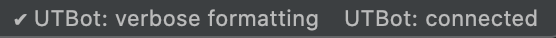
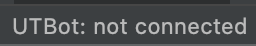
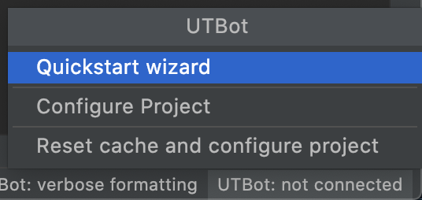
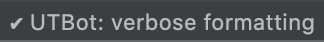
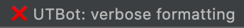
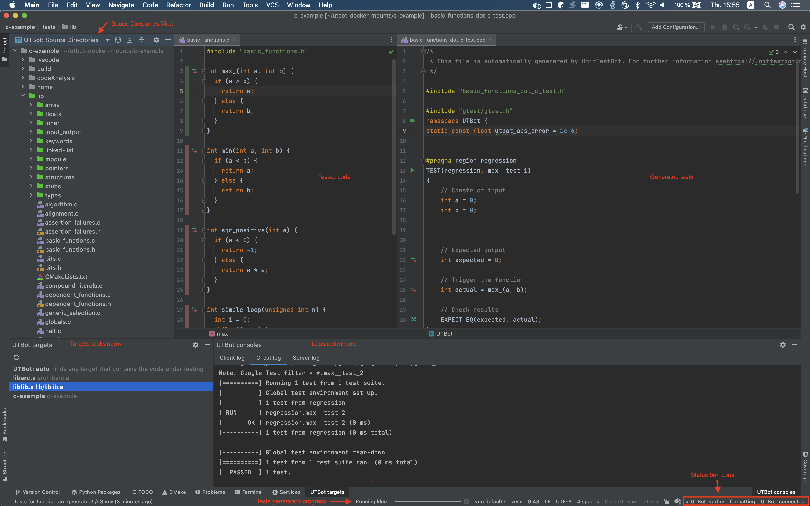
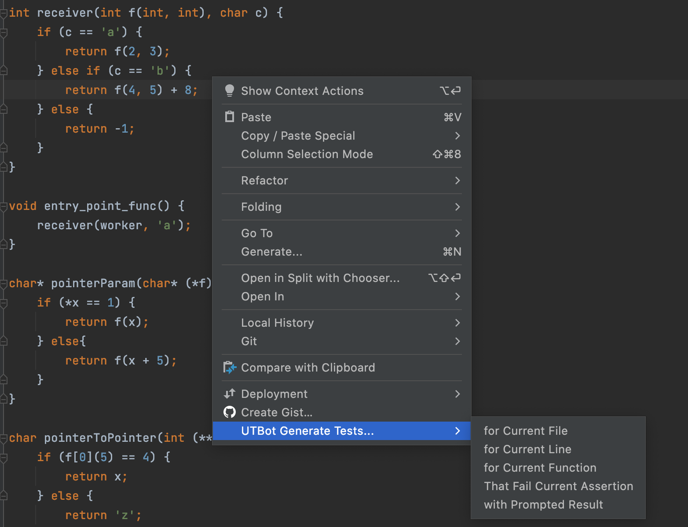
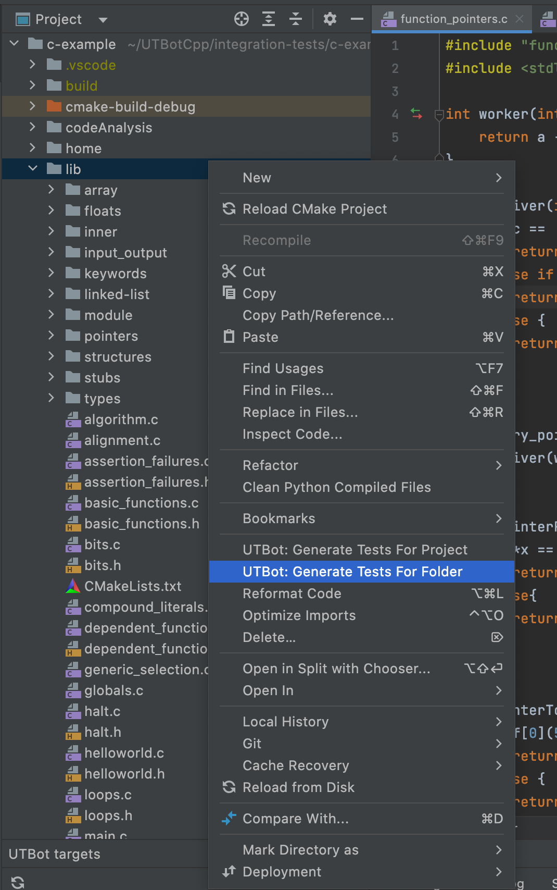
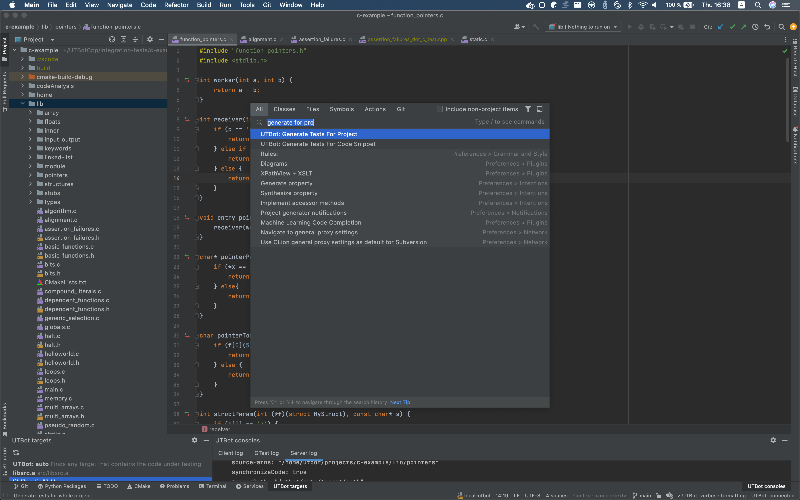

# How to use plugin

### Status bar icons

Before you start working with UTBot, it is worth to pay attention to the status bar in IDE
and UTBot-specific controls there:

#### Connection status

Connection status indicates whether the client and the server have established a connection. 
If the connection is lost, you'll see 

In such case you need to check if UTBot Docker container is still running.

Clicking on the connection status icon, you see the list of actions can be invoked:

#### Verbose mode

You can change the verbose option from status bar. 

If verbose mode is enabled or disabled, it is represented as follows:

 

 

### Plugin description

Main UI elements of the plugin are:
- Status bar icons, they show connection status and verbose mode option
- `UTBot consoles`, a window to show logs from server (GTest log, Server log) and plugin (Client log)
- `UTBot targets`, a window to show targets found by server in current project
- `UTBot Source Directories`, a view to show source directories marked green

#### Generate tests

You can trigger tests generation from:

- Context menu in editor: 

 

- Context menu in project view:

 

- Search window: pressing `Shift` two times and searching for action

 

